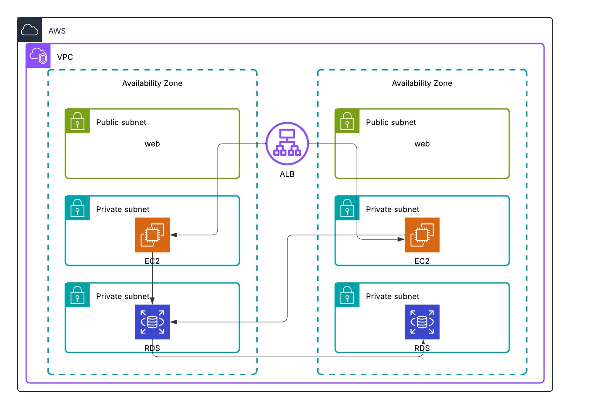

# Three-Tier-WebApp-Architecture
# Highly Available Three-Tier AWS Architecture



## 🌐 Architecture Overview
This solution implements a fault-tolerant three-tier web application across multiple Availability Zones (AZs) with:

- **Public-facing components** (Web tier)
- **Private application servers** (App tier)
- **Isolated database layer** (Data tier)
- **Load balancing** for traffic distribution

## 🏗️ Core Components

### 1️⃣ Web Tier (Public Subnets)
- **EC2 instances** running web servers (Apache/Nginx)
- Internet access via **Internet Gateway**
- Security hardened with:
  - Restricted security groups
  - AWS WAF protection
  - Regular AMI patching

### 2️⃣ Application Tier (Private Subnets)
- **EC2 instances** running application logic
- No direct internet access
- Communicates with:
  - Web tier via **ALB**
  - Database tier via **private VPC routes**
- Auto Scaling Group for horizontal scaling

### 3️⃣ Data Tier (Private Subnets)
- **Amazon RDS** (Multi-AZ deployment)
- Isolated in separate private subnets
- Backup and snapshots enabled
- Security features:
  - Encryption at rest
  - IAM database authentication

### 🚦 Traffic Flow
-Users → Internet → ALB → Web Tier → App Tier → Database
## 🔒 Security Design
- **Network Segmentation**:
  - Public/private subnet isolation
  - NACLs for subnet-level filtering
- **Access Control**:
  - IAM roles for EC2 instances
  - Security group least-privilege rules
- **Data Protection**:
  - RDS encryption (KMS)
  - SSL/TLS for all communications

## 🚀 Deployment Steps

### Prerequisites
- AWS account with VPC setup
- Terraform (optional for IaC)

### Manual Setup
1. **VPC Configuration**:
   ```bash
   aws ec2 create-vpc --cidr-block 10.0.0.0/16
   ALB Setup:

# Create Application Load Balancer in public subnets

# Configure listener rules for web tier

# EC2 Deployment:

# Launch web servers in public subnets

# Launch app servers in private subnets

# RDS Deployment:
aws rds create-db-instance --engine mysql --db-instance-class db.t3.micro
